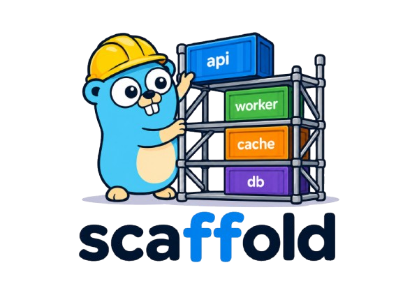

# scaffold

<p align="center">
  
</p>

### ***tldr***

Deploy an entire local environment for testing, development, or client side app stacks - all presented as a dead simple tool.

---

`scaffold` is a Go library for building ephemeral local infrastructure stacks around real containers. It is meant for quick-start environments used in tests, development tools, demos, and client applications that need to manage local services without carrying a full compose file or platform framework.

For instance - a complicated multi-service API service - with multiple APIs, backend databases, S3 object store, and some background processing - can be slowly built up as golang components and presented to the developer as a singular object that manages itself with an easy-to-use exposed interface. The resulting stack can also quickly be tied into a CLI tool for developer use.

`scaffold` is not only for tests. It is for ephemeral quick-start stacks used in testing, development, demos, and simplified local service management.

## Toolbox

Several useful premade stacks and services live in [scaffold-toolbox](https://github.com/hlfshell/scaffold-toolbox). There you can find common building blocks already made for you so you can easily build your own stack, or use them as examples for your own work.

Some example stacks supported are:

* `Postgres + Redis + API` for ordinary application development.
* `Postgres + Qdrant + MinIO` for local RAG and document search workflows.
* `LocalStack + app services` for S3, SQS, SNS, DynamoDB, and other AWS services.
* `MySQL + Memcached + worker` for cache-heavy backend development.

## The Basics

A `Service` is the smallest useful unit in `scaffold`.

It represents one thing your local environment can start and stop: Postgres, Redis, Qdrant, MinIO, an app container, a model server, a mock API, or even another `Stack`.

At the lowest level, the interface is intentionally tiny:

```go
type Service interface {
	Name() string
	Create(ctx context.Context) error
	Cleanup(ctx context.Context) error
	Logs(ctx context.Context) (logs.LogStreams, error)
}
```

That means `scaffold` services only need to clearly define four things:

- What is this thing called?
- How do I start it?
- How do I clean it up?
- How do I read its logs?

Everything else is optional.

The small interface is deliberate. Postgres and Redis are both services, but they do not expose the same useful behavior. Postgres might expose a `*sql.DB`, migrations, seed data, and connection strings. Redis might expose a client, seeded keys, and a TCP endpoint. A web app might expose HTTP URLs. A fake S3 service might expose buckets and an HTTP API.

If `Service` tried to model all of that, it would become awkward fast. Instead, `scaffold` standardizes lifecycle and composition, wherein `Service`s keeps the helpers that are meaningful for its own domain for the developer to expand upon.

Richer behavior is added through optional interfaces. Services can expose environment variables, endpoints, Docker labels, generated Docker name prefixes, and shared Docker networks. Stacks and generated CLIs check for those capabilities when they exist, without requiring every service to implement them.

`Container`s are lower-level Docker primitives. They describe the image, tag, ports, environment, bind mounts, command, and optional Docker network for one running container. While support is built around `Container`s running, it is not required; merely helpful.

A `Container` object knows how to start a container, assign ports, join a network, and clean up container resources. It does not know what "ready" means. For Redis, ready might mean port `6379` accepts TCP. For a web server, ready might mean `/healthz` returns `200`. For Postgres, ready might mean the database accepts connections and migrations have run.

Container primitives live in `scaffold/container`. It uses Docker's compatible API and tries `DOCKER_HOST`, the default Docker socket, and common Podman sockets, in that order.

## Simple Service from a Container

For simple one-container services, use the `ContainerService` to quickly get started:

```go
container, err := scaffoldcontainer.NewContainer(
	"web",
	"nginx",
	scaffoldcontainer.WithTag("alpine"),
	scaffoldcontainer.WithPort("80", ""),
)
if err != nil {
	return err
}

web, err := scaffold.FromContainer(
	container,
	scaffold.WithHTTPReady("80", "/", http.StatusOK, 30*time.Second),
	scaffold.WithEndpoint("web", "http", "80"),
)
```

## Typed Services

For more specialized infrastructure, write a typed service. A Postgres service can return a `*sql.DB` and run SQL setup. A Redis service can return a Redis client and seed keys. A MinIO service can create buckets and upload objects. A Qdrant service can create collections and insert points.

A `Stack` is an ordered group of services. It is the local environment you actually want to bring up: "the RAG backend", "the SaaS backend", "the local AWS test setup", or "the CI/CD pipeline".

Service ordering follows two rules:

- Services passed to the same `WithServices` call are created in parallel.
- Separate `WithServices` calls are created in the order they are applied.

Cleanup follows the same grouping in reverse. Later service groups are cleaned up before earlier service groups, and services in the same group are cleaned up in parallel. If a service fails during startup, already-created services are cleaned up.

```go
stack := scaffold.NewStack("rag-dev",
	scaffold.WithServices(postgres, qdrant, minio),
	scaffold.WithSharedNetwork(),
)

err := stack.Create(ctx)
if err != nil {
	return err
}
defer stack.Cleanup(context.WithoutCancel(ctx))
```

Use multiple calls when one service group depends on another. Here `db` and `queue` start together. After both are ready, `api` starts. During cleanup, `api` is cleaned up first, then `db` and `queue` are cleaned up together.

```go
stack := scaffold.NewStack("app",
	scaffold.WithServices(db, queue),
	scaffold.WithServices(api),
)
```

*Stacks are also services*. This unlocks a lot of modularity; we can make increasingly complicated stacks comprised of other stacks. That lets you build small, named pieces and compose them without losing the simple lifecycle model.

For example, a RAG stack can own Postgres, Qdrant, and MinIO. An agent stack could in turn be built with this RAG stack in mind.

```go
rag, err := presets.NewRAGStack("rag")
if err != nil {
	return err
}

app := scaffold.NewStack("agent-backend",
	scaffold.WithServices(rag),
	scaffold.WithServices(redis, ollama),
	scaffold.WithSharedNetwork(),
)
```

## LogStreams

Logs follow the same composition model. A service returns named `logs.LogStreams`, and a stack recursively collects the streams from its children. The root stack name is not prefixed, but child service and child stack names become path segments:

```text
api
data.postgres
data.redis
```

Call `CollectLogs` when you want selectable streams:

```go
streams, err := scaffold.CollectLogs(ctx, app)
if err != nil {
	return err
}
defer streams.Close()

postgresLogs, ok := streams.GetStream("data", "postgres")
```

Call `MergedLogs` when you want one reader containing every stream:

```go
logs, err := scaffold.MergedLogs(ctx, app)
if err != nil {
	return err
}
defer logs.Close()
```

## Labels and running stacks

`scaffold` labels Docker resources so a Go-defined stack can find matching local infrastructure after application restart. Containers and shared stack networks are labeled when they are created. Explicitly created named volumes should use the same labels. Anonymous volumes created from image metadata generally cannot be labeled at creation time, though `scaffold` still tracks and removes the anonymous volumes it discovers on a container during cleanup.

Labels allow local infrastructure to outlives the Go process that created it, but still be worked with later. This allows `scaffold` to:

- `status` can find containers, networks, and volumes for a defined stack.
- `down` can remove resources created by another process.
- nested stacks can inherit parent labels and still be discovered as one environment.
- multiple local environments can be separated by stack names, run IDs, or custom inherited labels.

`scaffold` protects certain keyword labels for its own uses:

* `scaffold.managed-by` - scaffold
* `scaffold.stack`      - <stack name>
* `scaffold.service`    - <service name>
* `scaffold.run-id`     - <run id>

`scaffold.stack` is the stable identity. `scaffold.run-id` identifies a specific startup run. If no run id is specified, `scaffold.run-id` is generated when `Create` starts. Before `Create`, discovery uses the stable stack labels and does not filter by run id.

These labels are enough to ask whether a stack is already running:

```go
stack := scaffold.NewStack("app",
	scaffold.WithServices(db, queue),
	scaffold.WithServices(api),
)

running, err := stack.IsRunning(ctx)
if err != nil {
	return err
}
```

You can also inspect the matching Docker resources:

```go
resources, err := stack.Resources(ctx)
if err != nil {
	return err
}

fmt.Println(resources.Containers)
fmt.Println(resources.Networks)
fmt.Println(resources.Volumes)
```

`RunningContainers` is also available when you only care about containers:

```go
containers, err := stack.RunningContainers(ctx)
```

Stacks labels are inheritable. Inherited labels are pushed down to child services and child stacks before they are created:

```go
stack := scaffold.NewStack("app",
	scaffold.WithRunID("app-dev"),
	scaffold.WithInheritedLabel("key", "value"),
	scaffold.WithInheritedLabel("env", "local"),
	scaffold.WithServices(db, queue),
	scaffold.WithServices(api),
)
```

In this example, every labeled resource created by the stack receives `key= value` and `env=local`.

## Generated names

`WithNamePrefix` makes Docker resource names easier to recognize in Docker Desktop and `docker ps` output:

```go
stack := scaffold.NewStack("app",
	scaffold.WithNamePrefix("hlfshell-dev"),
	scaffold.WithServices(db, redis),
)
```

Services that support generated names receive the prefix `hlfshell-dev-app`. Nested stacks extend the prefix - a child stack named `data` inside the `app` stack receives `hlfshell-dev-app-data` for its own services.

## Docker Compose

`scaffold/compose` can wrap a Docker Compose project as a `Service`. This is useful when a local environment already exists as Compose YAML, or when you want to ship a small Compose file inside a Go binary and still expose the same scaffold lifecycle, CLI, logs, and resource discovery behavior.

Compose support uses Docker Compose project labels, especially `com.docker.compose.project`, to discover containers, networks, and volumes. That means a fresh Go process can still answer `status`, collect logs, or run `down` for a previously started Compose project as long as it uses the same project name.

By default, `Create` runs:

```bash
docker compose up -d --wait --wait-timeout 120
```

The wait timeout is configurable. You can also add a final Go readiness
check for application-specific validation after Compose reports that the
project is running or healthy.

```go
package dev

import (
	"context"
	"embed"
	"fmt"
	"net/http"
	"time"

	"github.com/hlfshell/scaffold/compose"
)

//go:embed compose.yaml
var composeFiles embed.FS

func NewDevEnvironment() (*compose.Compose, error) {
	contents, err := composeFiles.ReadFile("compose.yaml")
	if err != nil {
		return nil, err
	}

	return compose.New("app-compose",
		compose.WithProject("app-dev"),
		compose.WithEmbeddedFile("compose.yaml", contents),
		compose.WithWaitTimeout(3*time.Minute),
		compose.WithReadyCheck(func(ctx context.Context, project *compose.Compose) error {
			req, err := http.NewRequestWithContext(ctx, http.MethodGet, "http://localhost:8080/healthz", nil)
			if err != nil {
				return err
			}

			res, err := http.DefaultClient.Do(req)
			if err != nil {
				return err
			}
			defer res.Body.Close()

			if res.StatusCode != http.StatusOK {
				return fmt.Errorf("unexpected status: %s", res.Status)
			}

			return nil
		}),
	)
}
```

`WithEmbeddedFile` is for Go's `go:embed` flow: the Compose YAML is compiled
into the binary, written to a temporary file when Compose runs, and removed
after the command exits. Use `WithFile("./compose.yaml")` when the file
should be read from disk instead.

## Helpers

Services can export environment variables and endpoints. A `Stack` collects those values after it has been created:

```go
err := stack.Create(ctx)
if err != nil {
	return err
}
defer stack.Cleanup(context.WithoutCancel(ctx))

env := stack.Env()
endpoint, ok := stack.Endpoint("postgres")
```

You can also write the environment to a dotenv-style file:

```go
err = stack.WriteEnvFile(".env.scaffold")
```

For CLI and demo workflows, `Summary` gives a short view of service groups and known endpoints:

```go
fmt.Println(stack.Summary())

/*
Stack app

Services:
  1. db, redis
  2. api

Endpoints:
  api = http://localhost:49154
  db  = localhost:49155
*/
```

To create an easy function helper to start a stack, run your functon, and then clean up the stack afterwards (regardless if there's an error), use `Run`:

```go
err := scaffold.Run(ctx, stack, func(ctx context.Context) error {
	return runIntegrationTests(ctx)
})
```

## Writing services

Most simple container-backed services should start with `FromContainer`. It keeps the common case small: start one container, wait until it is ready, expose endpoints, and forward container logs.

When the service needs typed behavior, write a small Go wrapper around the thing your application needs. At minimum, a service implements:

```go
type Service interface {
	Name() string
	Create(ctx context.Context) error
	Cleanup(ctx context.Context) error
	Logs(ctx context.Context) (logs.LogStreams, error)
}
```

For a specialized container-backed service, the usual pattern looks like this. The sketch omits constructors and connection-string details so the lifecycle shape stays visible:

```go
type Postgres struct {
	container *scaffoldcontainer.Container
	db        *sql.DB
}

func (p *Postgres) Name() string {
	return "postgres"
}

func (p *Postgres) Create(ctx context.Context) error {
	if err := p.container.Start(ctx); err != nil {
		return err
	}

	port, ok := p.container.HostPort("5432")
	if !ok {
		return fmt.Errorf("postgres container did not publish port 5432")
	}

	db, err := sql.Open("postgres", postgresURL(port))
	if err != nil {
		return err
	}
	p.db = db

	return scaffold.WaitFunc(ctx, 30*time.Second, 50*time.Millisecond, func(ctx context.Context) error {
		return p.db.PingContext(ctx)
	})
}

func (p *Postgres) Cleanup(ctx context.Context) error {
	if p.db != nil {
		_ = p.db.Close()
	}

	return p.container.Cleanup(ctx)
}

func (p *Postgres) Logs(ctx context.Context) (logs.LogStreams, error) {
	stream, err := p.container.Logs(ctx)
	if err != nil {
		return nil, err
	}

	return logs.LogStreams{"postgres": stream}, nil
}

func (p *Postgres) DB() *sql.DB {
	return p.db
}
```

Add helpers that are specific to the service, not generic configuration blobs. Postgres should have SQL helpers. MinIO should have bucket and object helpers. Qdrant should have collection and point helpers. The point is to make local infrastructure easy to call from Go without hiding what is being started.

## Waiters and Readiness Checks

`scaffold` includes small readiness helpers:

```go
scaffold.WaitForTCP(ctx, "localhost", port, 10*time.Second)
scaffold.WaitForHTTP(ctx, url, 200, 10*time.Second)
scaffold.WaitFunc(ctx, 10*time.Second, 50*time.Millisecond, func(ctx context.Context) error {
	return db.PingContext(ctx)
})
```

## Building images

`container.BuildDockerfile` builds a Dockerfile and returns the image id and Docker build logs. It is useful as a preflight check before constructing or starting a container from a local image.

```go
image, logs, err := scaffoldcontainer.BuildDockerfile(ctx, "./Dockerfile")
if err != nil {
	fmt.Println(logs)
	return err
}

fmt.Println(logs)
fmt.Println(image)
```

The build context is the directory containing the Dockerfile. Build failures still return the logs Docker emitted before the failure.

## Cleanup

Containers are killed and removed during cleanup. Anonymous Docker volumes discovered on the container are also removed. Stacks clean service groups up in reverse creation order.
